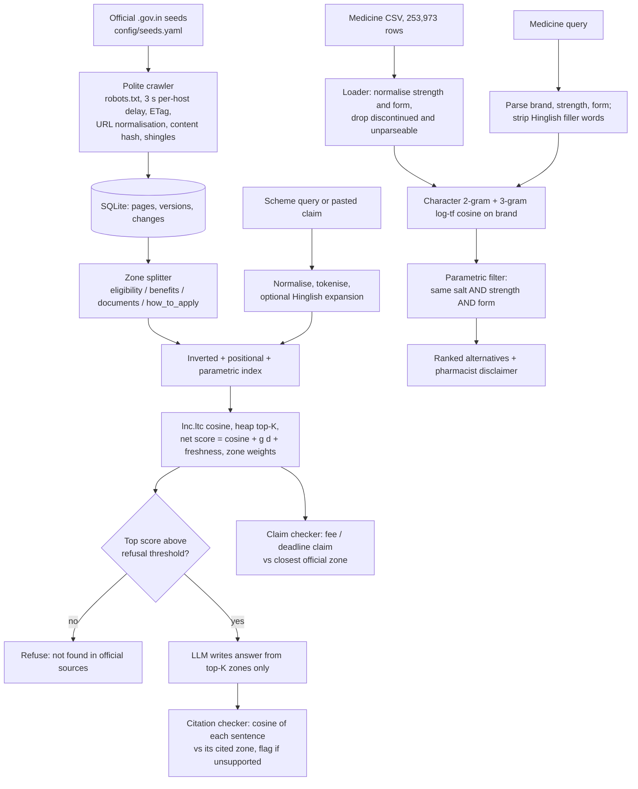

# Bharosa — trusted search for families who can't afford care

**CSD358 Information Retrieval · Mid-term Hackathon 2026 · Track T1: Retrieval-Augmented Generation and trustworthy answers**

*"Bharosa" means trust.*

When someone in a family falls sick, three questions come up at once: *Can this medicine cost less? Is there a government scheme that can help? Can I trust this message asking me to pay a fee?* The answers exist, but they are scattered across formal government pages and a quarter of a million medicine records, and the people asking type in Hinglish with spelling mistakes.

Bharosa is a search system for exactly this. Its one rule: **retrieval first, generation last, and never guess.** Every answer is traced to a ranked source, and when the evidence is weak the system refuses instead of inventing something.

| Module | You type | You get | LLM? |
|---|---|---|---|
| **Medicine finder** | `pantocid 40 sasta kya milega` | Brands with the same salt, same strength and same dosage form, ranked by similarity, with MRP | **No.** A hallucinated drug name is dangerous, so this is pure IR |
| **Scheme finder** | `health insurance for sanitation workers` | Ranked zones from official `.gov.in` pages, then a short answer where every sentence cites a zone | Yes, only over retrieved zones |
| **Claim checker** | `pay Rs 500 to activate free health card` | A verdict against the closest official passage, with the official line shown | Verdict is rule-based; an LLM may only reword the explanation |

---

## Why Track T1

T1 asks for *"a RAG system where the retriever is a real IR component that you can inspect, and where every generated claim can be traced to a ranked source."* That sentence is our design:

- **Chunking is a "what is a document" decision.** We index page *zones* (eligibility, benefits, documents, how to apply), not whole pages.
- **The retriever is ours and inspectable.** Inverted index, lnc.ltc cosine and heap top-K are written from scratch, and `--verbose` prints postings, weights and scores.
- **Every sentence is checked.** A citation checker re-scores each generated sentence against the zone it cites and flags unsupported ones.
- **It refuses.** Below a retrieval-confidence threshold the LLM is never called.
- **Where generation is unsafe, it is absent.** Medicine answers come straight from ranked records.

The crawler (a T4 idea) and Hinglish handling (a T5 idea) are supporting parts: they build the corpus and clean the query that the trustworthy-answer pipeline depends on.

---

## Pipeline



---

## IR principles and where they live

| IR principle (lecture topic) | File | Why we chose it |
|---|---|---|
| Inverted index: dictionary + postings with tf, df, idf | `bharosa/index/inverted.py` | Written from scratch so postings can be printed in the demo |
| Positional index and phrase queries | `bharosa/index/positional.py` | Exact scheme names such as "Mission Vatsalya" |
| Tokenisation, case folding, Unicode normalisation | `bharosa/text/normalize.py` | Mixed Latin and Devanagari input |
| Zone index, "what is a document" | `bharosa/text/zones.py`, `bharosa/index/zones.py` | Users ask about one zone at a time; zones are also the RAG chunks |
| Parametric index | `bharosa/index/params.py`, `bharosa/medicine/parametric.py` | State, condition and zone filters; salt, strength and form for medicines |
| tf-idf, vector space, lnc.ltc, cosine | `bharosa/rank/tfidf.py` | Core ranker, with per-term weights exposed |
| Heap-based top-K | `bharosa/rank/topk.py` | Result assembly without sorting the whole collection |
| Static quality g(d) and net score | `bharosa/rank/netscore.py` | Official source authority and freshness combined with cosine, each switchable for ablation |
| Dictionary query expansion | `bharosa/text/hinglish.py` | One-hop, reviewed-lexicon expansion; never guesses a translation |
| Character n-gram matching | `bharosa/medicine/ngram.py` | Misspelled brand names (`pantosid` finds `pantocid`) |
| Soundex | `bharosa/medicine/phonetic.py` | Syllabus phonetic technique, used as a baseline |
| Crawl loop, URL frontier, per-host politeness, robots.txt | `bharosa/crawl/run.py`, `frontier.py`, `fetcher.py` | Real corpus, collected ethically |
| URL normalisation, "content seen?" hash | `bharosa/crawl/dedup.py` | No duplicate fetches or duplicate documents |
| Shingles + Jaccard (k = 5, threshold 0.8) | `bharosa/crawl/shingles.py` | Near-duplicate pages |
| Freshness and adaptive recrawl | `bharosa/crawl/scheduler.py` | Halve the interval on change, grow 1.5x when unchanged |
| **Beyond syllabus:** BM25 | `bharosa/rank/bm25.py` | Baseline through the `rank_bm25` library |
| **Beyond IR:** cited generation, citation checking, refusal | `bharosa/rag/` | LLM explains retrieved zones only |

**Libraries, in IR terms.** `requests` fetches pages; `pyyaml` reads the seed list; `rank_bm25` is the BM25 baseline only. HTML parsing uses the Python standard library. The inverted index, positional index, lnc.ltc, cosine, heap top-K, n-gram similarity and Soundex are our own code.

---

## Setup

Python 3.11 or newer.

```bash
git clone https://github.com/ParthAgarwal682/Bharosa.git
cd Bharosa
python -m venv .venv
source .venv/bin/activate          # Windows: .venv\Scripts\activate
pip install -r requirements.txt
cp .env.example .env               # Windows: copy .env.example .env
```

Fill `.env` only if you want generated answers. Retrieval, the medicine finder, the claim checker and all evaluation run without an API key.

```text
LLM_PROVIDER=openrouter            # openai | anthropic | openrouter
LLM_MODEL=<model name>
LLM_API_KEY=<your key>
CRAWL_USER_AGENT=BharosaStudentCrawler/0.1 (contact: <your college email>)
```

## How to run

```bash
# 1. Tests (350 pass in about 2 seconds)
python -m pytest -q

# 2. Crawl the official seeds into data/bharosa.db (polite: 3 s per host)
python -m bharosa.crawl.run --seeds config/seeds.yaml --max-pages 50 --verbose

# 3. Medicine finder (no LLM). First call loads 235,155 records, allow ~30-50 s.
python -m bharosa.app.cli medicine "pantocid 40 sasta kya milega" \
    --medicine-file data/medicines/indian_pharmaceutical_products_clean.csv --verbose

# 4. Scheme finder: postings, weights, top-K scores, then the cited answer
python -m bharosa.app.cli scheme "health insurance for sanitation workers" -k 5 --g-score --verbose

# 5. Claim checker
python -m bharosa.app.cli claim "pay Rs 500 to activate free health card" --verbose

# 6. Web UI (optional) at http://127.0.0.1:8000/
python -m bharosa.api.server

# 7. Reproduce every evaluation table in eval/results/
python eval/run_eval.py
python eval/freshness_eval.py
```

Useful scheme flags: `--zone eligibility`, `--state <name>`, `--condition <name>`, `--zone-weights --zone-weight eligibility=1.5`, `--freshness`, `--bm25`, `--hinglish --lexicon <csv>`. Run `python -m bharosa.app.cli scheme -h` for the full list.

---

## Where the data comes from

| Data | Source | Notes |
|---|---|---|
| Scheme corpus | 9 official Government of India pages crawled by us: `socialjustice.gov.in` (AVYAY, geriatric caregivers, NAPDDR, NAMASTE, SMILE), `wcd.gov.in` (POSHAN 2.0, Mission Vatsalya, Mission Shakti), `dghs.mohfw.gov.in` | robots.txt checked per host, 3-second delay, identified User-Agent, no personal data. Per-seed verification in `docs/seeds.md`. The corpus is small on purpose: only verified official pages, split into zones |
| Medicine records | `data/medicines/indian_pharmaceutical_products_clean.csv`, 253,973 rows, 15 columns | **Static snapshot, not live.** Upstream source and licence: *[fill in before submission]*. Full audit in `DATA_AUDIT.md` |
| Judged queries | `eval/medicine_queries.csv` (29 queries; 15 verified against the dataset) and `eval/claims.csv` (5 drafts) | Written by the team |

After loading, **235,155** medicine records are accepted and 18,818 dropped: 10,756 with an unparseable strength, 7,905 discontinued, 153 duplicates, 4 with an invalid price. We never invent a missing strength.

---

## Evaluation

Everything below is produced by `python eval/run_eval.py` and `python eval/freshness_eval.py`. Nothing is hand-entered.

### Medicine finder against two baselines

15 verified queries over 235,155 records. Two definitions of relevance: the exact brand asked for, and what the user needs for substitution — a row with the **same salt, strength and form**.

| Method | Brand top-1 | Same salt/strength/form **P@5** | **P@10** | Rows returned per query |
|---|---|---|---|---|
| Exact match | 0.533 | 0.107 | 0.053 | 0 or 1 |
| Soundex | **0.867** | 0.240 | 0.127 | 24 to 499, unranked |
| **Ours: n-gram cosine + parametric filter** | 0.267 | **0.400** | **0.400** | at most 10, ranked |

How to read it:

- **Soundex finds the brand but cannot rank.** It has recall 1.0 and set precision 0.011: the right row is buried among hundreds that share a code.
- **Ours is precise when it answers.** On 6 of the 15 queries every one of the top 5 results is a true same-salt, same-strength, same-form match (P@5 = 1.0).
- **Ours abstains too often.** On 8 of 15 queries it returns nothing, because the brand cosine cutoff of 0.5 is strict. That is the honest reason the mean is 0.40 and brand top-1 is below Soundex. See limitations.

### Recrawl scheduling (SIMULATED)

No page changed during our 36 hours, so this is a labelled simulation: 10 URLs, 168 hours, 101 synthetic changes, equal budget of 500 requests, fixed seed.

| Scheduler | Requests used | Changes caught | Changes per request | Mean staleness |
|---|---|---|---|---|
| Fixed interval | 410 | 76 / 101 (75.2%) | 0.185 | 17.5 h |
| Adaptive (ours) | 218 | 65 / 101 (64.4%) | **0.298** | 34.8 h |

Adaptive is 61% more efficient per request and uses 47% fewer requests, at the cost of catching fewer changes and higher staleness. It is a politeness-versus-freshness trade-off, not a clear win.

### Sanity checks

- 350 unit tests on tiny hand-made examples with known answers, covering every module.
- RAG path on fixture zones with a fake LLM (`eval/results/rag_fixture_metrics.json`): the citation checker flags 1 of 3 sentences as unsupported and all 3 out-of-scope queries are refused. This checks the mechanism; it is **not** a quality number.

### Not yet measured

Scheme retrieval P@k, the net-score ablations, RAG answer correctness and claim-checker precision need human-judged queries that we did not finish labelling. `run_eval.py` reports these as `N/A` with the reason instead of printing a number.

---

## What works

- Polite live crawler with frontier, per-host delay, robots.txt, conditional requests, URL normalisation, content-hash and shingle deduplication, and versions stored in SQLite.
- Zone splitting of crawled pages and a from-scratch inverted, positional and parametric index.
- lnc.ltc cosine ranking, heap top-K, net score with g(d), freshness and zone weights, each switchable.
- BM25 baseline for scheme search.
- Medicine finder with query parsing, n-gram matching and the safe same-salt, same-strength, same-form filter.
- Cited RAG answers, sentence-level citation checker, refusal rule, and the fee and deadline claim checker.
- CLI with `--verbose` intermediate output, a small web UI, and a one-command evaluation.

## Limitations

- **Short or strength-in-the-name brands fail.** `Dolo 650` returns nothing: once `650` is parsed as the strength, the leftover `dolo` scores below the 0.5 cutoff against `dolo 650 tablet`. Combination medicines such as `Augmentin 625 Duo` are also skipped because they have no single strength.
- **Unknown filler words break the brand.** `calpol 500 sasta option kya milega` keeps `option` as part of the brand and falls to 0.48.
- **Results are ranked by brand similarity, not by price.** MRP is shown as a full-pack price; there is no generic or Jan Aushadhi price in the dataset.
- **Hinglish expansion needs a reviewed lexicon** (`config/hinglish_lexicon.csv`), which is not committed yet, so scheme queries are not expanded by default. The tokeniser keeps Devanagari tokens intact, but there is no transliteration between Devanagari and Latin spellings.
- **Small scheme corpus** of 9 pages, and no judged scheme queries yet.
- **Freshness numbers are simulated.**
- **Medicine search is slow** (about 30 to 50 s on the CLI), because it scores the query against all 235,155 brands with no candidate pruning.

## Planned next

1. A k-gram inverted index over brand names to prune candidates, and a combined n-gram + Soundex score, to fix both the speed and the abstentions.
2. 30+ judged scheme queries with qrels, then the zone-weight, g(d), freshness and Hinglish ablations.
3. A reviewed Hinglish lexicon and Devanagari transliteration.
4. Hybrid sparse + dense retrieval, with analysis of when each wins.
5. Jan Aushadhi prices and per-unit price ranking.
6. A larger crawl with real snapshots, to replace the simulated freshness result.

---

## Safety and ethics

- Medicine output is information only. Every result says: *confirm any substitution with a doctor or pharmacist.* The system never suggests a medicine for a symptom and never gives dosage advice.
- No Aadhaar numbers, phone numbers or medical records are asked for or stored.
- The crawler obeys robots.txt, waits 3 seconds between requests to a host, identifies itself, and skips a URL if robots.txt cannot be read.

## Team

| Member | Owns |
|---|---|
| Parth Agarwal | Crawler: fetcher, frontier, deduplication, shingles, scheduler, freshness evaluation; RAG answer, citation checker and claim checker |
| Paridhi | Inverted and positional index, tf-idf, net score, Hinglish expansion, scheme and medicine search, CLI, API, evaluation pipeline |
| Ishanvi Singh | Medicine dataset, loader and audit, Soundex baselines, evaluation queries, frontend |
| Mimi | *[fill in]* |

## AI-use declaration

AI coding assistants were used to draft code, tests and documentation, and an LLM API is used inside the system only for scheme answers. Tools and models: *[fill in: e.g. Cursor, Claude, the LLM_MODEL you ran]*. All evaluation numbers come from `eval/run_eval.py` and `eval/freshness_eval.py`. Full declaration in the report.
